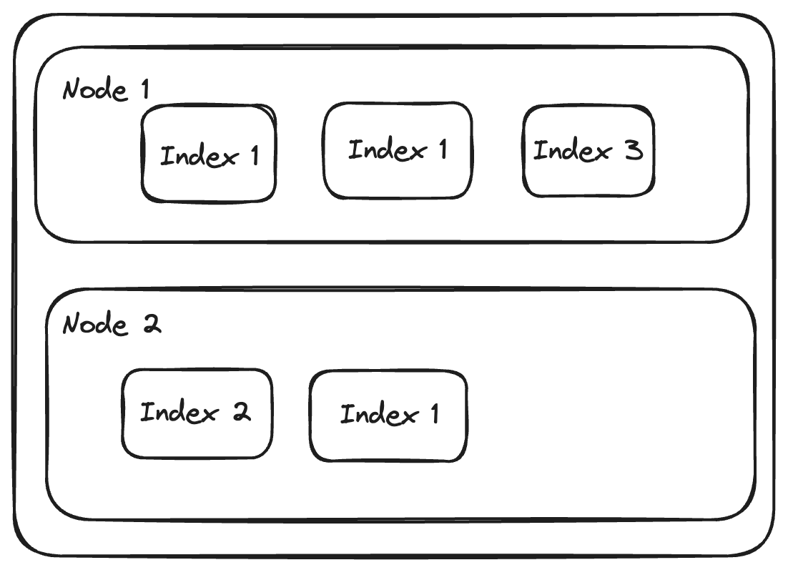
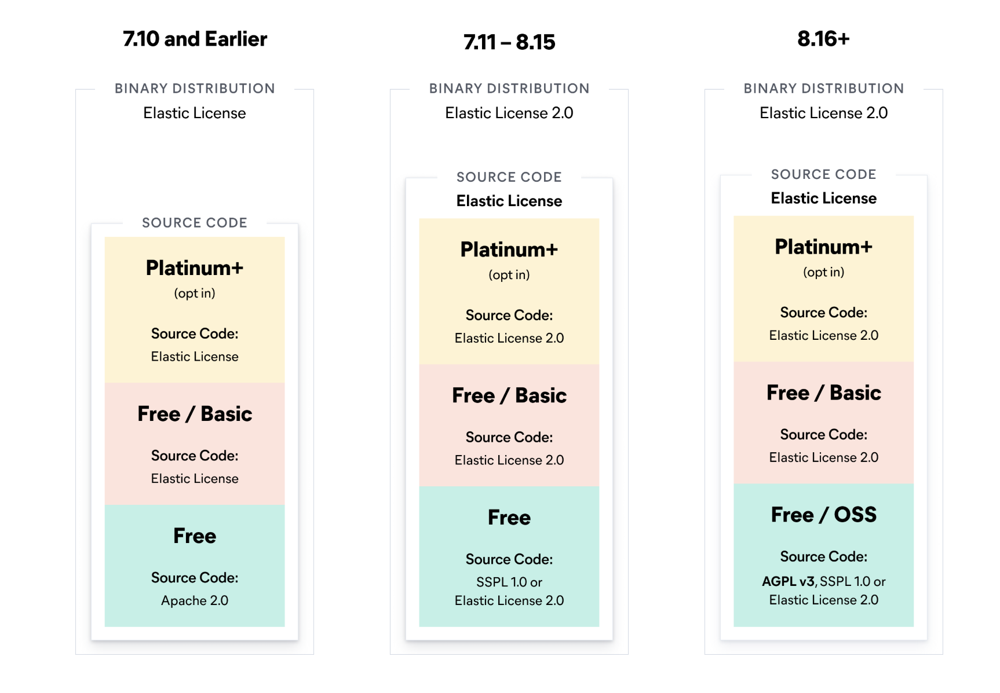

# Elasticsearch

Scott Stirling & Hernán Ibarra

# What is Elasticsearch

- It is a horizontally distributed NoSQL (non-relational) database/ search engine.
- To make search and update the database elastic search (Behaves like/uses a RESTful API) using HTTP VERBS - GET, POST, PUT, DELETE, etc. to make queries.
- Designed for very fast searching and analytics.

---

# Overview

- Documents == JSON files
- Inverse index (because querying faster)
- Shards (to horizontally scale faster)
- Nodes (to use different machines)
- Cluster
- Indexes (templates/namespaces for different types of data, address within the cluster)

---

# The Structure of Elasticsearch

In Elasticsearch data is organised in the following structure:

- First we have indices which are analogous to tables in a relational database.

- Each of these are comprised of shards which are parts of an index (more on the next slide).

- Then we have documents which are individual pieces of JSON.

---

# Shards & Nodes

So how does this help us?

- We can then split the index shards and put them on other Elasticsearch instances on nodes
  other machines/Elasticsearch instances.

- Meaning we can search an index in parallel.

---

# Structure

---

# Cap Theorem Details

- There is a lot of discussion over where Elasticsearch fits in the CAP Theorem. The general feeling is that it fits into AP with eventual consistency.

- Some Argument for why this is the case!!!!!!!!!!!!!!!!!!!!!!!!!!!!!!!!!!!!!!!!!!!!!!!!

- People generally seem conflicted online.

---

# Licensing

---

# What is OpenSearch

- A fork of ElasticSearch created in 2021.

# Who uses it and why?

- Uber uses it for it searching and storing geospatial data.
- Netflix uses ElasticSearch for its recommendation system.
